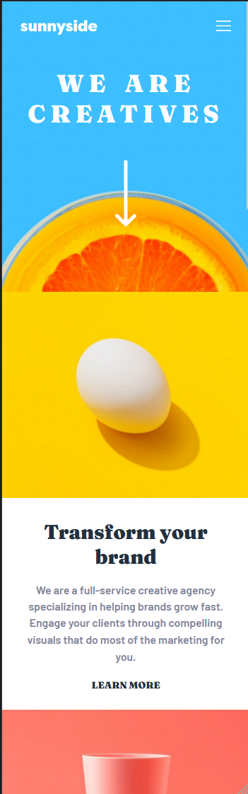

# Frontend Mentor - Sunnyside agency landing page solution

This is a solution to the [Sunnyside agency landing page challenge on Frontend Mentor](https://www.frontendmentor.io/challenges/sunnyside-agency-landing-page-7yVs3B6ef). Frontend Mentor challenges help you improve your coding skills by building realistic projects.

## Table of contents

- [Overview](#overview)
  - [The challenge](#the-challenge)
  - [Screenshots](#screenshots)
  - [Links](#links)
- [My process](#my-process)
  - [Built with](#built-with)
  - [What I learned](#what-i-learned)
  - [Useful resources](#useful-resources)
- [Author](#author)

## Overview

### The challenge

Users should be able to:

- View the optimal layout for the site depending on their device's screen size
- See hover states for all interactive elements on the page

### Screenshots




### Links

- Solution URL: [https://github.com/amidona/sunnyside-landing-page-fm](https://github.com/amidona/sunnyside-landing-page-fm)
- Live Site URL: [Add live site URL here](https://your-live-site-url.com)

## My process

### Built with

- Semantic HTML5 markup
- CSS custom properties
- Vanilla JavaScript
- Flexbox
- Mobile-first workflow

### What I learned

This was the first time I'd written a floating highlight code that was offset from the text it highlighted.

```css
#transform-more.hover::before {
    background: hsl(51, 100%, 49%);
    border-radius: 15px;
    content: "";
    height: 0.5em;
    left: -0.4em;
    padding: 0 0.5em;
    position: absolute;
    top: 0.8em;
    width: 100%;
    z-index: -1;
}
```

### Useful resources

- [Inkscape](https://inkscape.org/) - This is free opensource software for editing SVGs, which was perfect for editing the color of the SVG files I got in the design brief.

- [17+ Highlight Text Effects - Pure CSS](https://alvarotrigo.com/blog/css-highlight-text/) - This helped solidify how to get the hover highlight for the read more links.

## Author

- Website - [Allyce Amidon](https://allyceamidon.com/)
- Frontend Mentor - [@amidona](https://www.frontendmentor.io/profile/amidona)
- GitHub - [@amidona](https://github.com/amidona)
